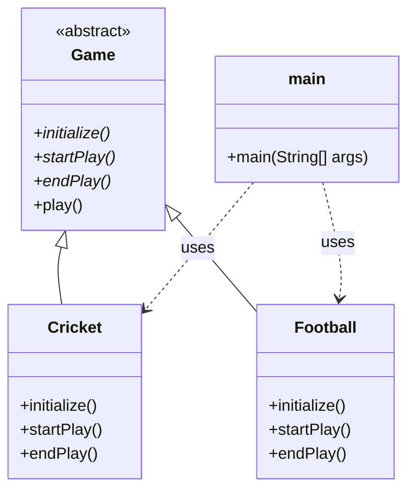

# ตัวอย่าง Template Method Pattern

โปรเจคนี้เป็นการสาธิตการใช้งาน Template Method design pattern อย่างง่ายในภาษา Java

## แผนภาพคลาส (Class Diagram)

## การทำงาน

Template Method pattern เป็นรูปแบบการออกแบบเชิงพฤติกรรม (Behavioral Design Pattern) ที่กำหนดโครงสร้างหลักของอัลกอริทึมไว้ในเมธอดแม่แบบ (Template Method) แต่จะปล่อยให้คลาสลูก (Subclass) เป็นผู้กำหนดรายละเอียดในแต่ละขั้นตอนเอง ทำให้คลาสลูกสามารถนิยามขั้นตอนย่อยของอัลกอริทึมได้ใหม่ โดยไม่กระทบกับโครงสร้างโดยรวม

1.  **`Game` (Abstract Class):** คลาสนี้เป็นผู้กำหนดเมธอดแม่แบบคือ `play()` ซึ่งเมธอดนี้จะกำหนดลำดับขั้นตอนการเล่นเกม ได้แก่ `initialize()`, `startPlay()`, และ `endPlay()` โดยทั้งสามเมธอดนี้ถูกประกาศเป็น `abstract` เพื่อบังคับให้คลาสลูกต้องนำไป implement เอง

2.  **`Cricket` & `Football` (Concrete Classes):** คลาสเหล่านี้สืบทอดมาจาก `Game` และทำการ implement เมธอด `initialize()`, `startPlay()`, และ `endPlay()` ให้มีรายละเอียดที่แตกต่างกันไปตามประเภทของเกมนั้นๆ

3.  **`main` (Client):** คลาส `main` เป็นส่วนที่แสดงการทำงานของ pattern นี้ โดยจะสร้าง object จากคลาส `Cricket` และ `Football` จากนั้นเรียกใช้เมธอด `play()` ซึ่งเป็นเมธอดที่สืบทอดมาจากคลาส `Game` ตัวเมธอด `play()` จะทำงานตามลำดับขั้นตอนที่กำหนดไว้ แต่จะเรียกใช้การ implement ของแต่ละขั้นตอนจากคลาสลูก (เช่น `Cricket` หรือ `Football`) ทำให้เห็นว่าโครงสร้างของอัลกอริทึม (`play`) ยังคงเดิม แต่รายละเอียดในแต่ละขั้นตอนสามารถเปลี่ยนแปลงได้
